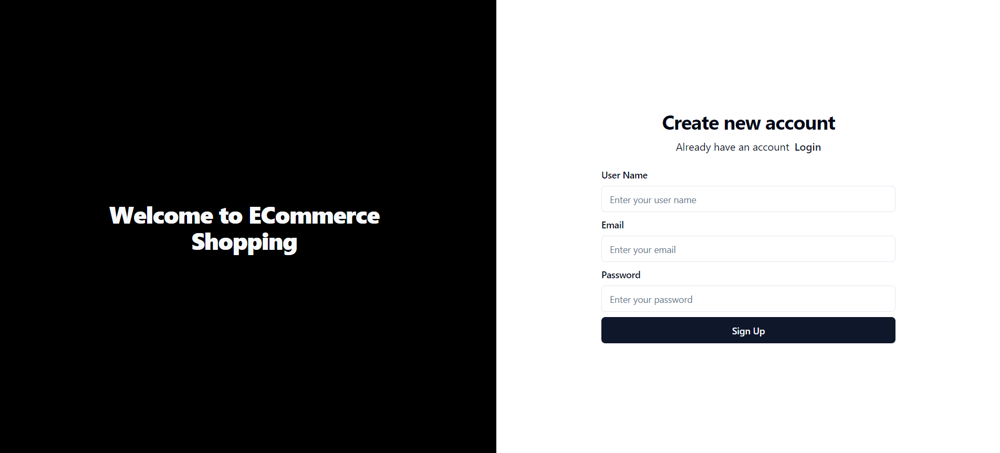
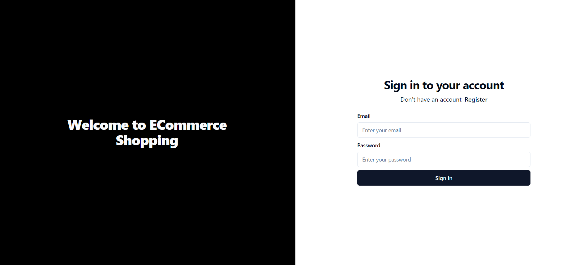
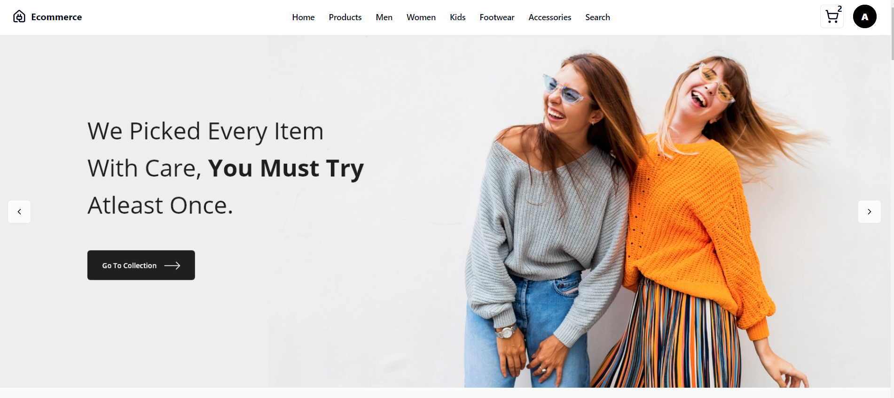
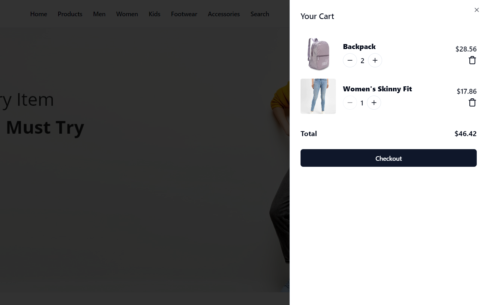
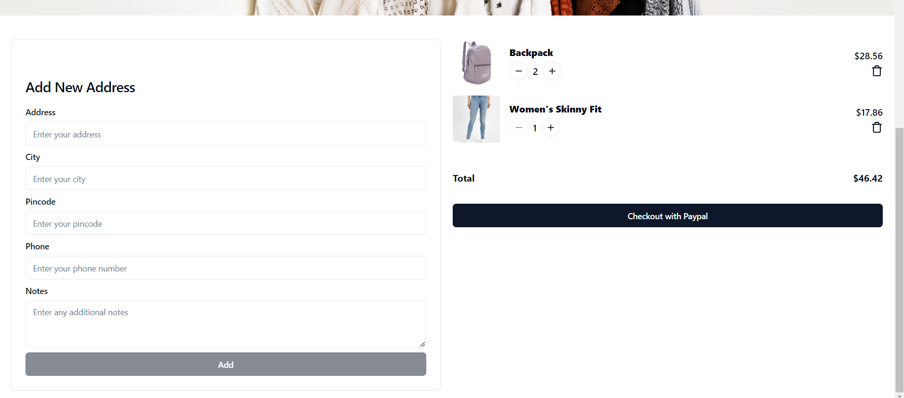
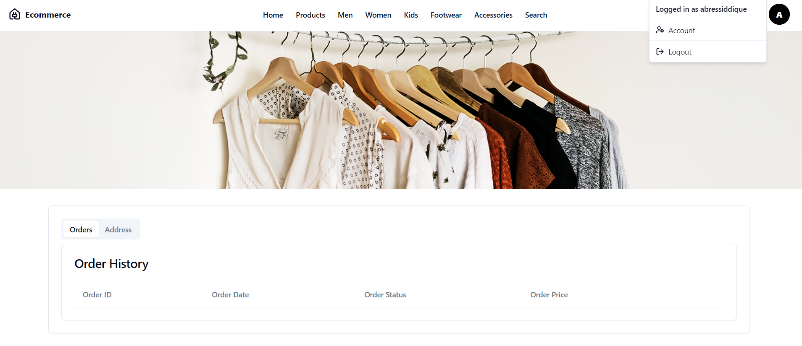
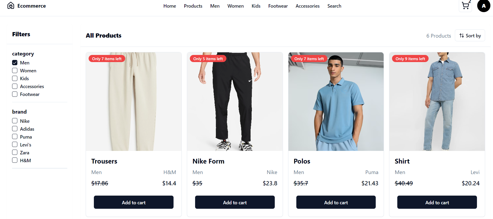
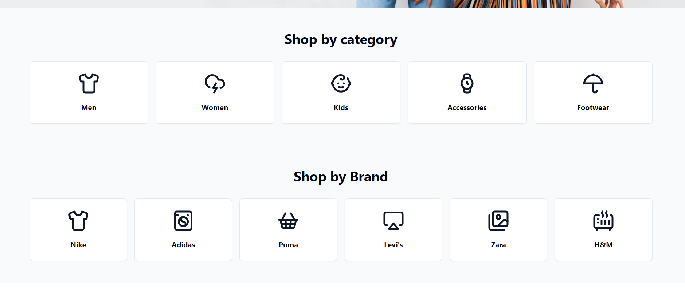

# MERN E-Commerce Website

## Overview

A full-stack e-commerce website using the MERN stack (MongoDB, Express.js, React, Node.js). Features include product browsing, user authentication, shopping cart, and an admin dashboard.

## Features

- Product Listings
- User Authentication
- Shopping Cart
- Order Management
- Admin Dashboard

## Technologies

- **Frontend:** React, Redux, Tailwind CSS
- **Backend:** Node.js, Express.js, MongoDB
- **Tools:** Axios, JWT, Bcrypt

## Project Screenshots

Here are some screenshots of the project:










## Installation

1. **Clone the Repository**

   ```bash
   git clone https://github.com/abressiddique/mern-ecommerce-website.git
